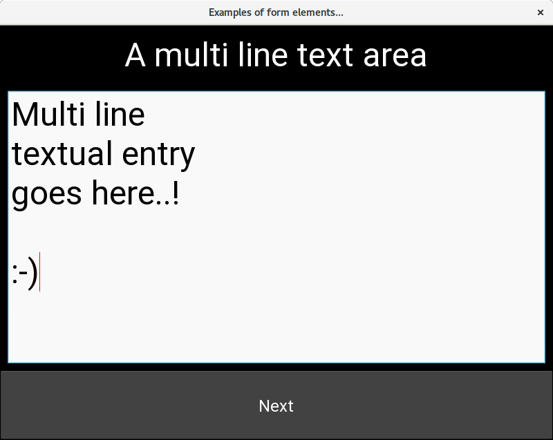
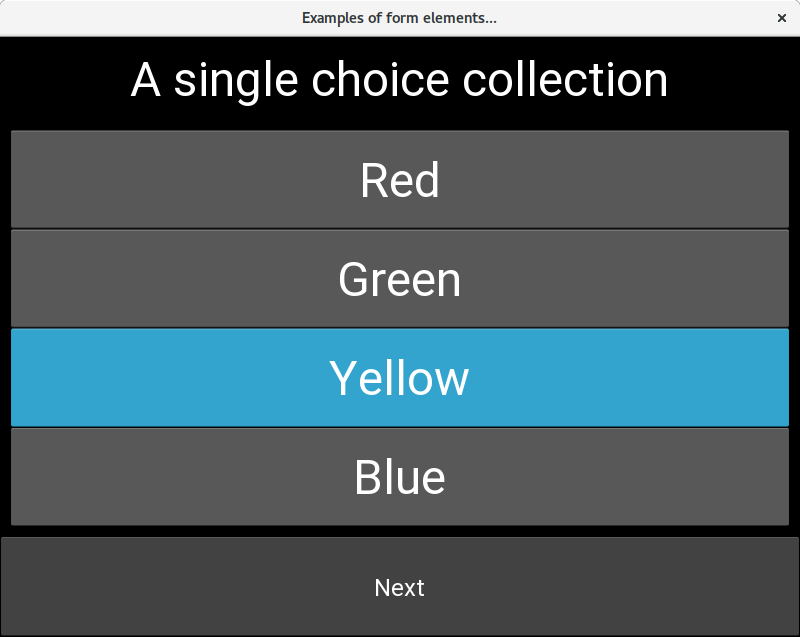
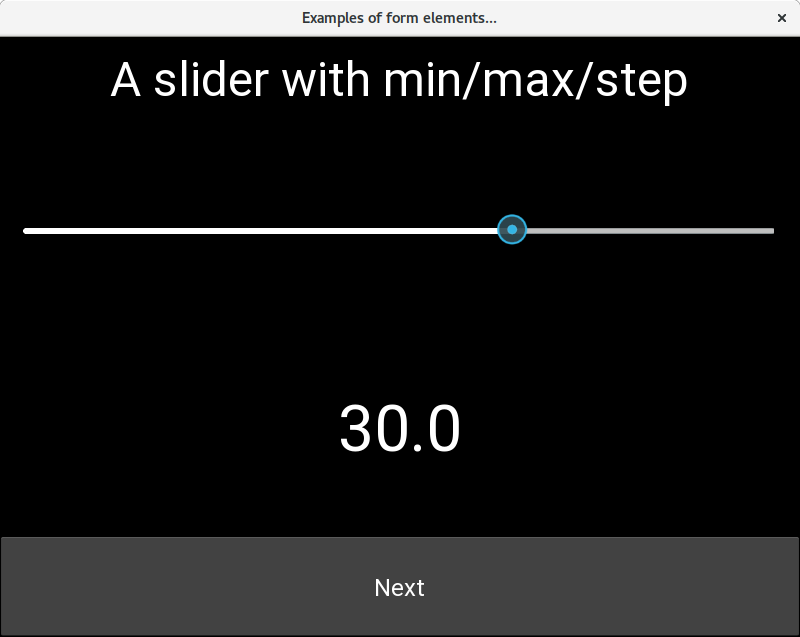
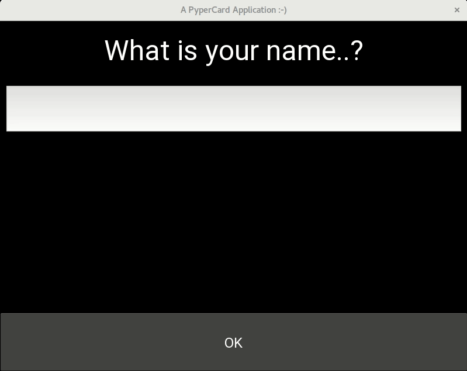

PyperCard CheatSheet
====================

PyperCard is an easy and simple GUI framework with a focus on beginner Python
programmers. This page contains all the technical information you need in one
place. You should use it for reference purposes. If you'd like to learn about
PyperCard you should consult the :doc:`tutorials`.

.. contents::
    :depth: 2

Installation
++++++++++++

PyperCard only works with Python 3.6 or above. It is built on the
`Kivy framework <https://kivy.org/>`_ and should work anywhere Kivy does
(Windows, OSX, Linux, Android and iOS).

PyperCard is on PyPI and can be installed thus::

    pip3 install pypercard

Check the installation works with the following "Hello World!" test app::

    from pypercard import CardApp, Card

    app = CardApp(stack=[Card("hello", text="Hello, World!"), ])
    app.run()

Save this somewhere (e.g. as ``test.py``) and run it with::

    python3 test.py 

If all goes to plan you should see a Window containing the words
"Hello, World" appear.

If you require help or support please
`use our chat channel <https://gitter.im/pypercard/community>`_. If you think
you've found a bug in PyperCard or would like to suggest a new feature or
improvement, please do so by raising a new issue via
`our GitHub page for the project <https://github.com/ntoll/pypercard/issues>`_.
We expect everyone to abide by our :doc:`code_of_conduct` -- we're a friendly
and welcoming project, but we won't tolerate rudeness, prejudice or other forms
of anti-social behaviour via our communication channels.

Core Concepts
+++++++++++++

PyperCard is inspired by `HyperCard <https://en.wikipedia.org/wiki/HyperCard>`_
and means you should be familiar with the following core concepts:

* An application is made from a **stack** of cards.
* Each **card** in the stack represents a screen in the application. At the
  very least, a card must have a **unique title** attribute (but will often
  have further attributes that define its content and behaviour).
* Users move between cards via **transitions**, usually activated by pressing a
  button.
* Transitions can be as simple as **a string identifying the title of the next
  card to display**. However, **a transition can also be a function** that
  returns a string identifying the next card to display. Business logic for the
  application happens in these transition functions.
* Simple **form inputs** can be used to capture input from the user.
* An application has a **data store** Python dictionary to be used to set and
  get arbitrary application state.
* Transition funtions always **take two arguments**, a reference to the
  application's ``data_store`` (containing application state) and the value of
  the ``form_input`` found on the preceeding card from which the user is
  transitioning.
* Future versions of PyperCard will **automate the packaging of your app** for
  Windows, OSX, Linux, Android and iOS.

The following diagram may help you visualise these concepts. There are three
cards in the application stack: ``blue``, ``white`` and ``yellow``. The
``blue`` card can transition to the ``white`` and ``yellow`` cards (as
demonstrated by the arrows).

.. raw:: html

    

Colours
+++++++

It is possible to set the colour of various aspects of the user interface (for
example, the text colour, background colour, button colour and button
background).

To make this as easy as possible for beginners, colours can be specified by
their English names. A full list of recognized colour names (and an example of
the colour) can be found in the palette shown below.

Alternatively, instead of naming the colour of choice, you can provide the
hex RGB value as a string in two common forms: ``0xRRGGBB`` (raw hex) and
``#RRGGBB`` (web hex).

.. raw:: html

  <table>
    <tr>
      <td>&nbsp&nbsp;&nbsp;&nbsp;</td><td>black</td>
      <td>&nbsp&nbsp;&nbsp;&nbsp;</td><td>dimgrey</td>
      <td>&nbsp&nbsp;&nbsp;&nbsp;</td><td>darkgrey</td>
      <td>&nbsp&nbsp;&nbsp;&nbsp;</td><td>grey</td>
    </tr>
    <tr>
      <td>&nbsp&nbsp;&nbsp;&nbsp;</td><td>grey0</td>
      <td>&nbsp&nbsp;&nbsp;&nbsp;</td><td>grey1</td>
      <td>&nbsp&nbsp;&nbsp;&nbsp;</td><td>grey2</td>
      <td>&nbsp&nbsp;&nbsp;&nbsp;</td><td>grey3</td>
    </tr>
    <tr>
      <td>&nbsp&nbsp;&nbsp;&nbsp;</td><td>grey4</td>
      <td>&nbsp&nbsp;&nbsp;&nbsp;</td><td>grey5</td>
      <td>&nbsp&nbsp;&nbsp;&nbsp;</td><td>grey6</td>
      <td>&nbsp&nbsp;&nbsp;&nbsp;</td><td>grey7</td>
    </tr>
    <tr>
      <td>&nbsp&nbsp;&nbsp;&nbsp;</td><td>grey8</td>
      <td>&nbsp&nbsp;&nbsp;&nbsp;</td><td>grey9</td>
      <td>&nbsp&nbsp;&nbsp;&nbsp;</td><td>grey10</td>
      <td>&nbsp&nbsp;&nbsp;&nbsp;</td><td>grey11</td>
    </tr>
    <tr>
      <td>&nbsp&nbsp;&nbsp;&nbsp;</td><td>grey12</td>
      <td>&nbsp&nbsp;&nbsp;&nbsp;</td><td>grey13</td>
      <td>&nbsp&nbsp;&nbsp;&nbsp;</td><td>grey14</td>
      <td>&nbsp&nbsp;&nbsp;&nbsp;</td><td>grey15</td>
    </tr>
    <tr>
      <td>&nbsp&nbsp;&nbsp;&nbsp;</td><td>grey16</td>
      <td>&nbsp&nbsp;&nbsp;&nbsp;</td><td>grey17</td>
      <td>&nbsp&nbsp;&nbsp;&nbsp;</td><td>grey18</td>
      <td>&nbsp&nbsp;&nbsp;&nbsp;</td><td>grey19</td>
    </tr>
    <tr>
      <td>&nbsp&nbsp;&nbsp;&nbsp;</td><td>grey20</td>
      <td>&nbsp&nbsp;&nbsp;&nbsp;</td><td>grey21</td>
      <td>&nbsp&nbsp;&nbsp;&nbsp;</td><td>grey22</td>
      <td>&nbsp&nbsp;&nbsp;&nbsp;</td><td>grey23</td>
    </tr>
    <tr>
      <td>&nbsp&nbsp;&nbsp;&nbsp;</td><td>grey24</td>
      <td>&nbsp&nbsp;&nbsp;&nbsp;</td><td>grey25</td>
      <td>&nbsp&nbsp;&nbsp;&nbsp;</td><td>grey26</td>
      <td>&nbsp&nbsp;&nbsp;&nbsp;</td><td>grey27</td>
    </tr>
    <tr>
      <td>&nbsp&nbsp;&nbsp;&nbsp;</td><td>grey28</td>
      <td>&nbsp&nbsp;&nbsp;&nbsp;</td><td>grey29</td>
      <td>&nbsp&nbsp;&nbsp;&nbsp;</td><td>grey30</td>
      <td>&nbsp&nbsp;&nbsp;&nbsp;</td><td>grey31</td>
    </tr>
    <tr>
      <td>&nbsp&nbsp;&nbsp;&nbsp;</td><td>grey32</td>
      <td>&nbsp&nbsp;&nbsp;&nbsp;</td><td>grey33</td>
      <td>&nbsp&nbsp;&nbsp;&nbsp;</td><td>grey34</td>
      <td>&nbsp&nbsp;&nbsp;&nbsp;</td><td>grey35</td>
    </tr>
    <tr>
      <td>&nbsp&nbsp;&nbsp;&nbsp;</td><td>grey36</td>
      <td>&nbsp&nbsp;&nbsp;&nbsp;</td><td>grey37</td>
      <td>&nbsp&nbsp;&nbsp;&nbsp;</td><td>grey38</td>
      <td>&nbsp&nbsp;&nbsp;&nbsp;</td><td>grey39</td>
    </tr>
    <tr>
      <td>&nbsp&nbsp;&nbsp;&nbsp;</td><td>grey40</td>
      <td>&nbsp&nbsp;&nbsp;&nbsp;</td><td>grey41</td>
      <td>&nbsp&nbsp;&nbsp;&nbsp;</td><td>grey42</td>
      <td>&nbsp&nbsp;&nbsp;&nbsp;</td><td>grey43</td>
    </tr>
    <tr>
      <td>&nbsp&nbsp;&nbsp;&nbsp;</td><td>grey44</td>
      <td>&nbsp&nbsp;&nbsp;&nbsp;</td><td>grey45</td>
      <td>&nbsp&nbsp;&nbsp;&nbsp;</td><td>grey46</td>
      <td>&nbsp&nbsp;&nbsp;&nbsp;</td><td>grey47</td>
    </tr>
    <tr>
      <td>&nbsp&nbsp;&nbsp;&nbsp;</td><td>grey48</td>
      <td>&nbsp&nbsp;&nbsp;&nbsp;</td><td>grey49</td>
      <td>&nbsp&nbsp;&nbsp;&nbsp;</td><td>grey50</td>
      <td>&nbsp&nbsp;&nbsp;&nbsp;</td><td>grey51</td>
    </tr>
    <tr>
      <td>&nbsp&nbsp;&nbsp;&nbsp;</td><td>grey52</td>
      <td>&nbsp&nbsp;&nbsp;&nbsp;</td><td>grey53</td>
      <td>&nbsp&nbsp;&nbsp;&nbsp;</td><td>grey54</td>
      <td>&nbsp&nbsp;&nbsp;&nbsp;</td><td>grey55</td>
    </tr>
    <tr>
      <td>&nbsp&nbsp;&nbsp;&nbsp;</td><td>grey56</td>
      <td>&nbsp&nbsp;&nbsp;&nbsp;</td><td>grey57</td>
      <td>&nbsp&nbsp;&nbsp;&nbsp;</td><td>grey58</td>
      <td>&nbsp&nbsp;&nbsp;&nbsp;</td><td>grey59</td>
    </tr>
    <tr>
      <td>&nbsp&nbsp;&nbsp;&nbsp;</td><td>grey60</td>
      <td>&nbsp&nbsp;&nbsp;&nbsp;</td><td>grey61</td>
      <td>&nbsp&nbsp;&nbsp;&nbsp;</td><td>grey62</td>
      <td>&nbsp&nbsp;&nbsp;&nbsp;</td><td>grey63</td>
    </tr>
    <tr>
      <td>&nbsp&nbsp;&nbsp;&nbsp;</td><td>grey64</td>
      <td>&nbsp&nbsp;&nbsp;&nbsp;</td><td>grey65</td>
      <td>&nbsp&nbsp;&nbsp;&nbsp;</td><td>grey66</td>
      <td>&nbsp&nbsp;&nbsp;&nbsp;</td><td>grey67</td>
    </tr>
    <tr>
      <td>&nbsp&nbsp;&nbsp;&nbsp;</td><td>grey68</td>
      <td>&nbsp&nbsp;&nbsp;&nbsp;</td><td>grey69</td>
      <td>&nbsp&nbsp;&nbsp;&nbsp;</td><td>grey70</td>
      <td>&nbsp&nbsp;&nbsp;&nbsp;</td><td>grey71</td>
    </tr>
    <tr>
      <td>&nbsp&nbsp;&nbsp;&nbsp;</td><td>grey72</td>
      <td>&nbsp&nbsp;&nbsp;&nbsp;</td><td>grey73</td>
      <td>&nbsp&nbsp;&nbsp;&nbsp;</td><td>grey74</td>
      <td>&nbsp&nbsp;&nbsp;&nbsp;</td><td>grey75</td>
    </tr>
    <tr>
      <td>&nbsp&nbsp;&nbsp;&nbsp;</td><td>grey76</td>
      <td>&nbsp&nbsp;&nbsp;&nbsp;</td><td>grey77</td>
      <td>&nbsp&nbsp;&nbsp;&nbsp;</td><td>grey78</td>
      <td>&nbsp&nbsp;&nbsp;&nbsp;</td><td>grey79</td>
    </tr>
    <tr>
      <td>&nbsp&nbsp;&nbsp;&nbsp;</td><td>grey80</td>
      <td>&nbsp&nbsp;&nbsp;&nbsp;</td><td>grey81</td>
      <td>&nbsp&nbsp;&nbsp;&nbsp;</td><td>grey82</td>
      <td>&nbsp&nbsp;&nbsp;&nbsp;</td><td>grey83</td>
    </tr>
    <tr>
      <td>&nbsp&nbsp;&nbsp;&nbsp;</td><td>grey84</td>
      <td>&nbsp&nbsp;&nbsp;&nbsp;</td><td>grey85</td>
      <td>&nbsp&nbsp;&nbsp;&nbsp;</td><td>grey86</td>
      <td>&nbsp&nbsp;&nbsp;&nbsp;</td><td>grey87</td>
    </tr>
    <tr>
      <td>&nbsp&nbsp;&nbsp;&nbsp;</td><td>grey88</td>
      <td>&nbsp&nbsp;&nbsp;&nbsp;</td><td>grey89</td>
      <td>&nbsp&nbsp;&nbsp;&nbsp;</td><td>grey90</td>
      <td>&nbsp&nbsp;&nbsp;&nbsp;</td><td>grey91</td>
    </tr>
    <tr>
      <td>&nbsp&nbsp;&nbsp;&nbsp;</td><td>grey92</td>
      <td>&nbsp&nbsp;&nbsp;&nbsp;</td><td>grey93</td>
      <td>&nbsp&nbsp;&nbsp;&nbsp;</td><td>grey94</td>
      <td>&nbsp&nbsp;&nbsp;&nbsp;</td><td>grey95</td>
    </tr>
    <tr>
      <td>&nbsp&nbsp;&nbsp;&nbsp;</td><td>grey96</td>
      <td>&nbsp&nbsp;&nbsp;&nbsp;</td><td>grey97</td>
      <td>&nbsp&nbsp;&nbsp;&nbsp;</td><td>grey98</td>
      <td>&nbsp&nbsp;&nbsp;&nbsp;</td><td>grey99</td>
    </tr>
    <tr>
      <td>&nbsp&nbsp;&nbsp;&nbsp;</td><td>lightgrey</td>
      <td>&nbsp&nbsp;&nbsp;&nbsp;</td><td>gainsboro</td>
      <td>&nbsp&nbsp;&nbsp;&nbsp;</td><td>whitesmoke</td>
      <td>&nbsp&nbsp;&nbsp;&nbsp;</td><td>white</td>
    </tr>
    <tr>
      <td>&nbsp&nbsp;&nbsp;&nbsp;</td><td>darkred</td>
      <td>&nbsp&nbsp;&nbsp;&nbsp;</td><td>saddlebrown</td>
      <td>&nbsp&nbsp;&nbsp;&nbsp;</td><td>sienna</td>
      <td>&nbsp&nbsp;&nbsp;&nbsp;</td><td>sienna1</td>
    </tr>
    <tr>
      <td>&nbsp&nbsp;&nbsp;&nbsp;</td><td>sienna2</td>
      <td>&nbsp&nbsp;&nbsp;&nbsp;</td><td>sienna3</td>
      <td>&nbsp&nbsp;&nbsp;&nbsp;</td><td>sienna4</td>
      <td>&nbsp&nbsp;&nbsp;&nbsp;</td><td>brown</td>
    </tr>
    <tr>
      <td>&nbsp&nbsp;&nbsp;&nbsp;</td><td>brown1</td>
      <td>&nbsp&nbsp;&nbsp;&nbsp;</td><td>brown2</td>
      <td>&nbsp&nbsp;&nbsp;&nbsp;</td><td>brown3</td>
      <td>&nbsp&nbsp;&nbsp;&nbsp;</td><td>brown4</td>
    </tr>
    <tr>
      <td>&nbsp&nbsp;&nbsp;&nbsp;</td><td>maroon</td>
      <td>&nbsp&nbsp;&nbsp;&nbsp;</td><td>maroon1</td>
      <td>&nbsp&nbsp;&nbsp;&nbsp;</td><td>maroon2</td>
      <td>&nbsp&nbsp;&nbsp;&nbsp;</td><td>maroon3</td>
    </tr>
    <tr>
      <td>&nbsp&nbsp;&nbsp;&nbsp;</td><td>maroon4</td>
      <td>&nbsp&nbsp;&nbsp;&nbsp;</td><td>firebrick</td>
      <td>&nbsp&nbsp;&nbsp;&nbsp;</td><td>firebrick1</td>
      <td>&nbsp&nbsp;&nbsp;&nbsp;</td><td>firebrick2</td>
    </tr>
    <tr>
      <td>&nbsp&nbsp;&nbsp;&nbsp;</td><td>firebrick3</td>
      <td>&nbsp&nbsp;&nbsp;&nbsp;</td><td>firebrick4</td>
      <td>&nbsp&nbsp;&nbsp;&nbsp;</td><td>darkgoldenrod</td>
      <td>&nbsp&nbsp;&nbsp;&nbsp;</td><td>darkgoldenrod1</td>
    </tr>
    <tr>
      <td>&nbsp&nbsp;&nbsp;&nbsp;</td><td>darkgoldenrod2</td>
      <td>&nbsp&nbsp;&nbsp;&nbsp;</td><td>darkgoldenrod3</td>
      <td>&nbsp&nbsp;&nbsp;&nbsp;</td><td>darkgoldenrod4</td>
      <td>&nbsp&nbsp;&nbsp;&nbsp;</td><td>rosybrown</td>
    </tr>
    <tr>
      <td>&nbsp&nbsp;&nbsp;&nbsp;</td><td>rosybrown1</td>
      <td>&nbsp&nbsp;&nbsp;&nbsp;</td><td>rosybrown2</td>
      <td>&nbsp&nbsp;&nbsp;&nbsp;</td><td>rosybrown3</td>
      <td>&nbsp&nbsp;&nbsp;&nbsp;</td><td>rosybrown4</td>
    </tr>
    <tr>
      <td>&nbsp&nbsp;&nbsp;&nbsp;</td><td>darkkhaki</td>
      <td>&nbsp&nbsp;&nbsp;&nbsp;</td><td>mediumvioletred</td>
      <td>&nbsp&nbsp;&nbsp;&nbsp;</td><td>indianred</td>
      <td>&nbsp&nbsp;&nbsp;&nbsp;</td><td>indianred1</td>
    </tr>
    <tr>
      <td>&nbsp&nbsp;&nbsp;&nbsp;</td><td>indianred2</td>
      <td>&nbsp&nbsp;&nbsp;&nbsp;</td><td>indianred3</td>
      <td>&nbsp&nbsp;&nbsp;&nbsp;</td><td>indianred4</td>
      <td>&nbsp&nbsp;&nbsp;&nbsp;</td><td>peru</td>
    </tr>
    <tr>
      <td>&nbsp&nbsp;&nbsp;&nbsp;</td><td>violetred</td>
      <td>&nbsp&nbsp;&nbsp;&nbsp;</td><td>violetred1</td>
      <td>&nbsp&nbsp;&nbsp;&nbsp;</td><td>violetred2</td>
      <td>&nbsp&nbsp;&nbsp;&nbsp;</td><td>violetred3</td>
    </tr>
    <tr>
      <td>&nbsp&nbsp;&nbsp;&nbsp;</td><td>violetred4</td>
      <td>&nbsp&nbsp;&nbsp;&nbsp;</td><td>chocolate</td>
      <td>&nbsp&nbsp;&nbsp;&nbsp;</td><td>chocolate1</td>
      <td>&nbsp&nbsp;&nbsp;&nbsp;</td><td>chocolate2</td>
    </tr>
    <tr>
      <td>&nbsp&nbsp;&nbsp;&nbsp;</td><td>chocolate3</td>
      <td>&nbsp&nbsp;&nbsp;&nbsp;</td><td>chocolate4</td>
      <td>&nbsp&nbsp;&nbsp;&nbsp;</td><td>tan</td>
      <td>&nbsp&nbsp;&nbsp;&nbsp;</td><td>tan1</td>
    </tr>
    <tr>
      <td>&nbsp&nbsp;&nbsp;&nbsp;</td><td>tan2</td>
      <td>&nbsp&nbsp;&nbsp;&nbsp;</td><td>tan3</td>
      <td>&nbsp&nbsp;&nbsp;&nbsp;</td><td>tan4</td>
      <td>&nbsp&nbsp;&nbsp;&nbsp;</td><td>orchid</td>
    </tr>
    <tr>
      <td>&nbsp&nbsp;&nbsp;&nbsp;</td><td>orchid1</td>
      <td>&nbsp&nbsp;&nbsp;&nbsp;</td><td>orchid2</td>
      <td>&nbsp&nbsp;&nbsp;&nbsp;</td><td>orchid3</td>
      <td>&nbsp&nbsp;&nbsp;&nbsp;</td><td>orchid4</td>
    </tr>
    <tr>
      <td>&nbsp&nbsp;&nbsp;&nbsp;</td><td>goldenrod</td>
      <td>&nbsp&nbsp;&nbsp;&nbsp;</td><td>goldenrod1</td>
      <td>&nbsp&nbsp;&nbsp;&nbsp;</td><td>goldenrod2</td>
      <td>&nbsp&nbsp;&nbsp;&nbsp;</td><td>goldenrod3</td>
    </tr>
    <tr>
      <td>&nbsp&nbsp;&nbsp;&nbsp;</td><td>goldenrod4</td>
      <td>&nbsp&nbsp;&nbsp;&nbsp;</td><td>palevioletred</td>
      <td>&nbsp&nbsp;&nbsp;&nbsp;</td><td>palevioletred1</td>
      <td>&nbsp&nbsp;&nbsp;&nbsp;</td><td>palevioletred2</td>
    </tr>
    <tr>
      <td>&nbsp&nbsp;&nbsp;&nbsp;</td><td>palevioletred3</td>
      <td>&nbsp&nbsp;&nbsp;&nbsp;</td><td>palevioletred4</td>
      <td>&nbsp&nbsp;&nbsp;&nbsp;</td><td>burlywood</td>
      <td>&nbsp&nbsp;&nbsp;&nbsp;</td><td>burlywood1</td>
    </tr>
    <tr>
      <td>&nbsp&nbsp;&nbsp;&nbsp;</td><td>burlywood2</td>
      <td>&nbsp&nbsp;&nbsp;&nbsp;</td><td>burlywood3</td>
      <td>&nbsp&nbsp;&nbsp;&nbsp;</td><td>burlywood4</td>
      <td>&nbsp&nbsp;&nbsp;&nbsp;</td><td>darksalmon</td>
    </tr>
    <tr>
      <td>&nbsp&nbsp;&nbsp;&nbsp;</td><td>lightgoldenrod</td>
      <td>&nbsp&nbsp;&nbsp;&nbsp;</td><td>lightgoldenrod1</td>
      <td>&nbsp&nbsp;&nbsp;&nbsp;</td><td>lightgoldenrod2</td>
      <td>&nbsp&nbsp;&nbsp;&nbsp;</td><td>lightgoldenrod3</td>
    </tr>
    <tr>
      <td>&nbsp&nbsp;&nbsp;&nbsp;</td><td>lightgoldenrod4</td>
      <td>&nbsp&nbsp;&nbsp;&nbsp;</td><td>palegoldenrod</td>
      <td>&nbsp&nbsp;&nbsp;&nbsp;</td><td>lightcoral</td>
      <td>&nbsp&nbsp;&nbsp;&nbsp;</td><td>khaki</td>
    </tr>
    <tr>
      <td>&nbsp&nbsp;&nbsp;&nbsp;</td><td>khaki1</td>
      <td>&nbsp&nbsp;&nbsp;&nbsp;</td><td>khaki2</td>
      <td>&nbsp&nbsp;&nbsp;&nbsp;</td><td>khaki3</td>
      <td>&nbsp&nbsp;&nbsp;&nbsp;</td><td>khaki4</td>
    </tr>
    <tr>
      <td>&nbsp&nbsp;&nbsp;&nbsp;</td><td>sandybrown</td>
      <td>&nbsp&nbsp;&nbsp;&nbsp;</td><td>wheat</td>
      <td>&nbsp&nbsp;&nbsp;&nbsp;</td><td>wheat1</td>
      <td>&nbsp&nbsp;&nbsp;&nbsp;</td><td>wheat2</td>
    </tr>
    <tr>
      <td>&nbsp&nbsp;&nbsp;&nbsp;</td><td>wheat3</td>
      <td>&nbsp&nbsp;&nbsp;&nbsp;</td><td>wheat4</td>
      <td>&nbsp&nbsp;&nbsp;&nbsp;</td><td>salmon</td>
      <td>&nbsp&nbsp;&nbsp;&nbsp;</td><td>salmon1</td>
    </tr>
    <tr>
      <td>&nbsp&nbsp;&nbsp;&nbsp;</td><td>salmon2</td>
      <td>&nbsp&nbsp;&nbsp;&nbsp;</td><td>salmon3</td>
      <td>&nbsp&nbsp;&nbsp;&nbsp;</td><td>salmon4</td>
      <td>&nbsp&nbsp;&nbsp;&nbsp;</td><td>antiquewhite</td>
    </tr>
    <tr>
      <td>&nbsp&nbsp;&nbsp;&nbsp;</td><td>antiquewhite1</td>
      <td>&nbsp&nbsp;&nbsp;&nbsp;</td><td>antiquewhite2</td>
      <td>&nbsp&nbsp;&nbsp;&nbsp;</td><td>antiquewhite3</td>
      <td>&nbsp&nbsp;&nbsp;&nbsp;</td><td>antiquewhite4</td>
    </tr>
    <tr>
      <td>&nbsp&nbsp;&nbsp;&nbsp;</td><td>linen</td>
      <td>&nbsp&nbsp;&nbsp;&nbsp;</td><td>oldlace</td>
      <td>&nbsp&nbsp;&nbsp;&nbsp;</td><td>red</td>
      <td>&nbsp&nbsp;&nbsp;&nbsp;</td><td>red1</td>
    </tr>
    <tr>
      <td>&nbsp&nbsp;&nbsp;&nbsp;</td><td>red2</td>
      <td>&nbsp&nbsp;&nbsp;&nbsp;</td><td>red3</td>
      <td>&nbsp&nbsp;&nbsp;&nbsp;</td><td>red4</td>
      <td>&nbsp&nbsp;&nbsp;&nbsp;</td><td>deeppink</td>
    </tr>
    <tr>
      <td>&nbsp&nbsp;&nbsp;&nbsp;</td><td>deeppink1</td>
      <td>&nbsp&nbsp;&nbsp;&nbsp;</td><td>deeppink2</td>
      <td>&nbsp&nbsp;&nbsp;&nbsp;</td><td>deeppink3</td>
      <td>&nbsp&nbsp;&nbsp;&nbsp;</td><td>deeppink4</td>
    </tr>
    <tr>
      <td>&nbsp&nbsp;&nbsp;&nbsp;</td><td>orangered</td>
      <td>&nbsp&nbsp;&nbsp;&nbsp;</td><td>orangered1</td>
      <td>&nbsp&nbsp;&nbsp;&nbsp;</td><td>orangered2</td>
      <td>&nbsp&nbsp;&nbsp;&nbsp;</td><td>orangered3</td>
    </tr>
    <tr>
      <td>&nbsp&nbsp;&nbsp;&nbsp;</td><td>orangered4</td>
      <td>&nbsp&nbsp;&nbsp;&nbsp;</td><td>tomato</td>
      <td>&nbsp&nbsp;&nbsp;&nbsp;</td><td>tomato1</td>
      <td>&nbsp&nbsp;&nbsp;&nbsp;</td><td>tomato2</td>
    </tr>
    <tr>
      <td>&nbsp&nbsp;&nbsp;&nbsp;</td><td>tomato3</td>
      <td>&nbsp&nbsp;&nbsp;&nbsp;</td><td>tomato4</td>
      <td>&nbsp&nbsp;&nbsp;&nbsp;</td><td>hotpink</td>
      <td>&nbsp&nbsp;&nbsp;&nbsp;</td><td>hotpink1</td>
    </tr>
    <tr>
      <td>&nbsp&nbsp;&nbsp;&nbsp;</td><td>hotpink2</td>
      <td>&nbsp&nbsp;&nbsp;&nbsp;</td><td>hotpink3</td>
      <td>&nbsp&nbsp;&nbsp;&nbsp;</td><td>hotpink4</td>
      <td>&nbsp&nbsp;&nbsp;&nbsp;</td><td>coral</td>
    </tr>
    <tr>
      <td>&nbsp&nbsp;&nbsp;&nbsp;</td><td>coral1</td>
      <td>&nbsp&nbsp;&nbsp;&nbsp;</td><td>coral2</td>
      <td>&nbsp&nbsp;&nbsp;&nbsp;</td><td>coral3</td>
      <td>&nbsp&nbsp;&nbsp;&nbsp;</td><td>coral4</td>
    </tr>
    <tr>
      <td>&nbsp&nbsp;&nbsp;&nbsp;</td><td>darkorange</td>
      <td>&nbsp&nbsp;&nbsp;&nbsp;</td><td>darkorange1</td>
      <td>&nbsp&nbsp;&nbsp;&nbsp;</td><td>darkorange2</td>
      <td>&nbsp&nbsp;&nbsp;&nbsp;</td><td>darkorange3</td>
    </tr>
    <tr>
      <td>&nbsp&nbsp;&nbsp;&nbsp;</td><td>darkorange4</td>
      <td>&nbsp&nbsp;&nbsp;&nbsp;</td><td>lightsalmon</td>
      <td>&nbsp&nbsp;&nbsp;&nbsp;</td><td>lightsalmon1</td>
      <td>&nbsp&nbsp;&nbsp;&nbsp;</td><td>lightsalmon2</td>
    </tr>
    <tr>
      <td>&nbsp&nbsp;&nbsp;&nbsp;</td><td>lightsalmon3</td>
      <td>&nbsp&nbsp;&nbsp;&nbsp;</td><td>lightsalmon4</td>
      <td>&nbsp&nbsp;&nbsp;&nbsp;</td><td>orange</td>
      <td>&nbsp&nbsp;&nbsp;&nbsp;</td><td>orange1</td>
    </tr>
    <tr>
      <td>&nbsp&nbsp;&nbsp;&nbsp;</td><td>orange2</td>
      <td>&nbsp&nbsp;&nbsp;&nbsp;</td><td>orange3</td>
      <td>&nbsp&nbsp;&nbsp;&nbsp;</td><td>orange4</td>
      <td>&nbsp&nbsp;&nbsp;&nbsp;</td><td>lightpink</td>
    </tr>
    <tr>
      <td>&nbsp&nbsp;&nbsp;&nbsp;</td><td>lightpink1</td>
      <td>&nbsp&nbsp;&nbsp;&nbsp;</td><td>lightpink2</td>
      <td>&nbsp&nbsp;&nbsp;&nbsp;</td><td>lightpink3</td>
      <td>&nbsp&nbsp;&nbsp;&nbsp;</td><td>lightpink4</td>
    </tr>
    <tr>
      <td>&nbsp&nbsp;&nbsp;&nbsp;</td><td>pink</td>
      <td>&nbsp&nbsp;&nbsp;&nbsp;</td><td>pink1</td>
      <td>&nbsp&nbsp;&nbsp;&nbsp;</td><td>pink2</td>
      <td>&nbsp&nbsp;&nbsp;&nbsp;</td><td>pink3</td>
    </tr>
    <tr>
      <td>&nbsp&nbsp;&nbsp;&nbsp;</td><td>pink4</td>
      <td>&nbsp&nbsp;&nbsp;&nbsp;</td><td>gold</td>
      <td>&nbsp&nbsp;&nbsp;&nbsp;</td><td>gold1</td>
      <td>&nbsp&nbsp;&nbsp;&nbsp;</td><td>gold2</td>
    </tr>
    <tr>
      <td>&nbsp&nbsp;&nbsp;&nbsp;</td><td>gold3</td>
      <td>&nbsp&nbsp;&nbsp;&nbsp;</td><td>gold4</td>
      <td>&nbsp&nbsp;&nbsp;&nbsp;</td><td>peachpuff</td>
      <td>&nbsp&nbsp;&nbsp;&nbsp;</td><td>peachpuff1</td>
    </tr>
    <tr>
      <td>&nbsp&nbsp;&nbsp;&nbsp;</td><td>peachpuff2</td>
      <td>&nbsp&nbsp;&nbsp;&nbsp;</td><td>peachpuff3</td>
      <td>&nbsp&nbsp;&nbsp;&nbsp;</td><td>peachpuff4</td>
      <td>&nbsp&nbsp;&nbsp;&nbsp;</td><td>navajowhite</td>
    </tr>
    <tr>
      <td>&nbsp&nbsp;&nbsp;&nbsp;</td><td>navajowhite1</td>
      <td>&nbsp&nbsp;&nbsp;&nbsp;</td><td>navajowhite2</td>
      <td>&nbsp&nbsp;&nbsp;&nbsp;</td><td>navajowhite3</td>
      <td>&nbsp&nbsp;&nbsp;&nbsp;</td><td>navajowhite4</td>
    </tr>
    <tr>
      <td>&nbsp&nbsp;&nbsp;&nbsp;</td><td>moccasin</td>
      <td>&nbsp&nbsp;&nbsp;&nbsp;</td><td>bisque</td>
      <td>&nbsp&nbsp;&nbsp;&nbsp;</td><td>bisque1</td>
      <td>&nbsp&nbsp;&nbsp;&nbsp;</td><td>bisque2</td>
    </tr>
    <tr>
      <td>&nbsp&nbsp;&nbsp;&nbsp;</td><td>bisque3</td>
      <td>&nbsp&nbsp;&nbsp;&nbsp;</td><td>bisque4</td>
      <td>&nbsp&nbsp;&nbsp;&nbsp;</td><td>mistyrose</td>
      <td>&nbsp&nbsp;&nbsp;&nbsp;</td><td>mistyrose1</td>
    </tr>
    <tr>
      <td>&nbsp&nbsp;&nbsp;&nbsp;</td><td>mistyrose2</td>
      <td>&nbsp&nbsp;&nbsp;&nbsp;</td><td>mistyrose3</td>
      <td>&nbsp&nbsp;&nbsp;&nbsp;</td><td>mistyrose4</td>
      <td>&nbsp&nbsp;&nbsp;&nbsp;</td><td>blanchedalmond</td>
    </tr>
    <tr>
      <td>&nbsp&nbsp;&nbsp;&nbsp;</td><td>papayawhip</td>
      <td>&nbsp&nbsp;&nbsp;&nbsp;</td><td>lavenderblush</td>
      <td>&nbsp&nbsp;&nbsp;&nbsp;</td><td>lavenderblush1</td>
      <td>&nbsp&nbsp;&nbsp;&nbsp;</td><td>lavenderblush2</td>
    </tr>
    <tr>
      <td>&nbsp&nbsp;&nbsp;&nbsp;</td><td>lavenderblush3</td>
      <td>&nbsp&nbsp;&nbsp;&nbsp;</td><td>lavenderblush4</td>
      <td>&nbsp&nbsp;&nbsp;&nbsp;</td><td>seashell</td>
      <td>&nbsp&nbsp;&nbsp;&nbsp;</td><td>seashell1</td>
    </tr>
    <tr>
      <td>&nbsp&nbsp;&nbsp;&nbsp;</td><td>seashell2</td>
      <td>&nbsp&nbsp;&nbsp;&nbsp;</td><td>seashell3</td>
      <td>&nbsp&nbsp;&nbsp;&nbsp;</td><td>seashell4</td>
      <td>&nbsp&nbsp;&nbsp;&nbsp;</td><td>cornsilk</td>
    </tr>
    <tr>
      <td>&nbsp&nbsp;&nbsp;&nbsp;</td><td>cornsilk1</td>
      <td>&nbsp&nbsp;&nbsp;&nbsp;</td><td>cornsilk2</td>
      <td>&nbsp&nbsp;&nbsp;&nbsp;</td><td>cornsilk3</td>
      <td>&nbsp&nbsp;&nbsp;&nbsp;</td><td>cornsilk4</td>
    </tr>
    <tr>
      <td>&nbsp&nbsp;&nbsp;&nbsp;</td><td>lemonchiffon</td>
      <td>&nbsp&nbsp;&nbsp;&nbsp;</td><td>lemonchiffon1</td>
      <td>&nbsp&nbsp;&nbsp;&nbsp;</td><td>lemonchiffon2</td>
      <td>&nbsp&nbsp;&nbsp;&nbsp;</td><td>lemonchiffon3</td>
    </tr>
    <tr>
      <td>&nbsp&nbsp;&nbsp;&nbsp;</td><td>lemonchiffon4</td>
      <td>&nbsp&nbsp;&nbsp;&nbsp;</td><td>floralwhite</td>
      <td>&nbsp&nbsp;&nbsp;&nbsp;</td><td>snow</td>
      <td>&nbsp&nbsp;&nbsp;&nbsp;</td><td>snow1</td>
    </tr>
    <tr>
      <td>&nbsp&nbsp;&nbsp;&nbsp;</td><td>snow2</td>
      <td>&nbsp&nbsp;&nbsp;&nbsp;</td><td>snow3</td>
      <td>&nbsp&nbsp;&nbsp;&nbsp;</td><td>snow4</td>
      <td>&nbsp&nbsp;&nbsp;&nbsp;</td><td>darkolivegreen</td>
    </tr>
    <tr>
      <td>&nbsp&nbsp;&nbsp;&nbsp;</td><td>darkolivegreen1</td>
      <td>&nbsp&nbsp;&nbsp;&nbsp;</td><td>darkolivegreen2</td>
      <td>&nbsp&nbsp;&nbsp;&nbsp;</td><td>darkolivegreen3</td>
      <td>&nbsp&nbsp;&nbsp;&nbsp;</td><td>darkolivegreen4</td>
    </tr>
    <tr>
      <td>&nbsp&nbsp;&nbsp;&nbsp;</td><td>olivedrab</td>
      <td>&nbsp&nbsp;&nbsp;&nbsp;</td><td>olivedrab1</td>
      <td>&nbsp&nbsp;&nbsp;&nbsp;</td><td>olivedrab2</td>
      <td>&nbsp&nbsp;&nbsp;&nbsp;</td><td>olivedrab3</td>
    </tr>
    <tr>
      <td>&nbsp&nbsp;&nbsp;&nbsp;</td><td>olivedrab4</td>
      <td>&nbsp&nbsp;&nbsp;&nbsp;</td><td>lawngreen</td>
      <td>&nbsp&nbsp;&nbsp;&nbsp;</td><td>chartreuse</td>
      <td>&nbsp&nbsp;&nbsp;&nbsp;</td><td>chartreuse1</td>
    </tr>
    <tr>
      <td>&nbsp&nbsp;&nbsp;&nbsp;</td><td>chartreuse2</td>
      <td>&nbsp&nbsp;&nbsp;&nbsp;</td><td>chartreuse3</td>
      <td>&nbsp&nbsp;&nbsp;&nbsp;</td><td>chartreuse4</td>
      <td>&nbsp&nbsp;&nbsp;&nbsp;</td><td>yellowgreen</td>
    </tr>
    <tr>
      <td>&nbsp&nbsp;&nbsp;&nbsp;</td><td>greenyellow</td>
      <td>&nbsp&nbsp;&nbsp;&nbsp;</td><td>beige</td>
      <td>&nbsp&nbsp;&nbsp;&nbsp;</td><td>lightgoldenrodyellow</td>
      <td>&nbsp&nbsp;&nbsp;&nbsp;</td><td>yellow</td>
    </tr>
    <tr>
      <td>&nbsp&nbsp;&nbsp;&nbsp;</td><td>yellow1</td>
      <td>&nbsp&nbsp;&nbsp;&nbsp;</td><td>yellow2</td>
      <td>&nbsp&nbsp;&nbsp;&nbsp;</td><td>yellow3</td>
      <td>&nbsp&nbsp;&nbsp;&nbsp;</td><td>yellow4</td>
    </tr>
    <tr>
      <td>&nbsp&nbsp;&nbsp;&nbsp;</td><td>lightyellow</td>
      <td>&nbsp&nbsp;&nbsp;&nbsp;</td><td>lightyellow1</td>
      <td>&nbsp&nbsp;&nbsp;&nbsp;</td><td>lightyellow2</td>
      <td>&nbsp&nbsp;&nbsp;&nbsp;</td><td>lightyellow3</td>
    </tr>
    <tr>
      <td>&nbsp&nbsp;&nbsp;&nbsp;</td><td>lightyellow4</td>
      <td>&nbsp&nbsp;&nbsp;&nbsp;</td><td>ivory</td>
      <td>&nbsp&nbsp;&nbsp;&nbsp;</td><td>ivory1</td>
      <td>&nbsp&nbsp;&nbsp;&nbsp;</td><td>ivory2</td>
    </tr>
    <tr>
      <td>&nbsp&nbsp;&nbsp;&nbsp;</td><td>ivory3</td>
      <td>&nbsp&nbsp;&nbsp;&nbsp;</td><td>ivory4</td>
      <td>&nbsp&nbsp;&nbsp;&nbsp;</td><td>darkgreen</td>
      <td>&nbsp&nbsp;&nbsp;&nbsp;</td><td>mediumspringgreen</td>
    </tr>
    <tr>
      <td>&nbsp&nbsp;&nbsp;&nbsp;</td><td>green</td>
      <td>&nbsp&nbsp;&nbsp;&nbsp;</td><td>green1</td>
      <td>&nbsp&nbsp;&nbsp;&nbsp;</td><td>green2</td>
      <td>&nbsp&nbsp;&nbsp;&nbsp;</td><td>green3</td>
    </tr>
    <tr>
      <td>&nbsp&nbsp;&nbsp;&nbsp;</td><td>green4</td>
      <td>&nbsp&nbsp;&nbsp;&nbsp;</td><td>springgreen</td>
      <td>&nbsp&nbsp;&nbsp;&nbsp;</td><td>springgreen1</td>
      <td>&nbsp&nbsp;&nbsp;&nbsp;</td><td>springgreen2</td>
    </tr>
    <tr>
      <td>&nbsp&nbsp;&nbsp;&nbsp;</td><td>springgreen3</td>
      <td>&nbsp&nbsp;&nbsp;&nbsp;</td><td>springgreen4</td>
      <td>&nbsp&nbsp;&nbsp;&nbsp;</td><td>lightseagreen</td>
      <td>&nbsp&nbsp;&nbsp;&nbsp;</td><td>forestgreen</td>
    </tr>
    <tr>
      <td>&nbsp&nbsp;&nbsp;&nbsp;</td><td>seagreen</td>
      <td>&nbsp&nbsp;&nbsp;&nbsp;</td><td>seagreen1</td>
      <td>&nbsp&nbsp;&nbsp;&nbsp;</td><td>seagreen2</td>
      <td>&nbsp&nbsp;&nbsp;&nbsp;</td><td>seagreen3</td>
    </tr>
    <tr>
      <td>&nbsp&nbsp;&nbsp;&nbsp;</td><td>seagreen4</td>
      <td>&nbsp&nbsp;&nbsp;&nbsp;</td><td>limegreen</td>
      <td>&nbsp&nbsp;&nbsp;&nbsp;</td><td>mediumseagreen</td>
      <td>&nbsp&nbsp;&nbsp;&nbsp;</td><td>turquoise</td>
    </tr>
    <tr>
      <td>&nbsp&nbsp;&nbsp;&nbsp;</td><td>turquoise1</td>
      <td>&nbsp&nbsp;&nbsp;&nbsp;</td><td>turquoise2</td>
      <td>&nbsp&nbsp;&nbsp;&nbsp;</td><td>turquoise3</td>
      <td>&nbsp&nbsp;&nbsp;&nbsp;</td><td>turquoise4</td>
    </tr>
    <tr>
      <td>&nbsp&nbsp;&nbsp;&nbsp;</td><td>mediumturquoise</td>
      <td>&nbsp&nbsp;&nbsp;&nbsp;</td><td>mediumaquamarine</td>
      <td>&nbsp&nbsp;&nbsp;&nbsp;</td><td>aquamarine</td>
      <td>&nbsp&nbsp;&nbsp;&nbsp;</td><td>aquamarine1</td>
    </tr>
    <tr>
      <td>&nbsp&nbsp;&nbsp;&nbsp;</td><td>aquamarine2</td>
      <td>&nbsp&nbsp;&nbsp;&nbsp;</td><td>aquamarine3</td>
      <td>&nbsp&nbsp;&nbsp;&nbsp;</td><td>aquamarine4</td>
      <td>&nbsp&nbsp;&nbsp;&nbsp;</td><td>darkseagreen</td>
    </tr>
    <tr>
      <td>&nbsp&nbsp;&nbsp;&nbsp;</td><td>darkseagreen1</td>
      <td>&nbsp&nbsp;&nbsp;&nbsp;</td><td>darkseagreen2</td>
      <td>&nbsp&nbsp;&nbsp;&nbsp;</td><td>darkseagreen3</td>
      <td>&nbsp&nbsp;&nbsp;&nbsp;</td><td>darkseagreen4</td>
    </tr>
    <tr>
      <td>&nbsp&nbsp;&nbsp;&nbsp;</td><td>lightgreen</td>
      <td>&nbsp&nbsp;&nbsp;&nbsp;</td><td>palegreen</td>
      <td>&nbsp&nbsp;&nbsp;&nbsp;</td><td>palegreen1</td>
      <td>&nbsp&nbsp;&nbsp;&nbsp;</td><td>palegreen2</td>
    </tr>
    <tr>
      <td>&nbsp&nbsp;&nbsp;&nbsp;</td><td>palegreen3</td>
      <td>&nbsp&nbsp;&nbsp;&nbsp;</td><td>palegreen4</td>
      <td>&nbsp&nbsp;&nbsp;&nbsp;</td><td>honeydew</td>
      <td>&nbsp&nbsp;&nbsp;&nbsp;</td><td>honeydew1</td>
    </tr>
    <tr>
      <td>&nbsp&nbsp;&nbsp;&nbsp;</td><td>honeydew2</td>
      <td>&nbsp&nbsp;&nbsp;&nbsp;</td><td>honeydew3</td>
      <td>&nbsp&nbsp;&nbsp;&nbsp;</td><td>honeydew4</td>
      <td>&nbsp&nbsp;&nbsp;&nbsp;</td><td>mintcream</td>
    </tr>
    <tr>
      <td>&nbsp&nbsp;&nbsp;&nbsp;</td><td>darkcyan</td>
      <td>&nbsp&nbsp;&nbsp;&nbsp;</td><td>deepskyblue</td>
      <td>&nbsp&nbsp;&nbsp;&nbsp;</td><td>deepskyblue1</td>
      <td>&nbsp&nbsp;&nbsp;&nbsp;</td><td>deepskyblue2</td>
    </tr>
    <tr>
      <td>&nbsp&nbsp;&nbsp;&nbsp;</td><td>deepskyblue3</td>
      <td>&nbsp&nbsp;&nbsp;&nbsp;</td><td>deepskyblue4</td>
      <td>&nbsp&nbsp;&nbsp;&nbsp;</td><td>darkturquoise</td>
      <td>&nbsp&nbsp;&nbsp;&nbsp;</td><td>cyan</td>
    </tr>
    <tr>
      <td>&nbsp&nbsp;&nbsp;&nbsp;</td><td>cyan1</td>
      <td>&nbsp&nbsp;&nbsp;&nbsp;</td><td>cyan2</td>
      <td>&nbsp&nbsp;&nbsp;&nbsp;</td><td>cyan3</td>
      <td>&nbsp&nbsp;&nbsp;&nbsp;</td><td>cyan4</td>
    </tr>
    <tr>
      <td>&nbsp&nbsp;&nbsp;&nbsp;</td><td>dodgerblue</td>
      <td>&nbsp&nbsp;&nbsp;&nbsp;</td><td>dodgerblue1</td>
      <td>&nbsp&nbsp;&nbsp;&nbsp;</td><td>dodgerblue2</td>
      <td>&nbsp&nbsp;&nbsp;&nbsp;</td><td>dodgerblue3</td>
    </tr>
    <tr>
      <td>&nbsp&nbsp;&nbsp;&nbsp;</td><td>dodgerblue4</td>
      <td>&nbsp&nbsp;&nbsp;&nbsp;</td><td>darkslategrey</td>
      <td>&nbsp&nbsp;&nbsp;&nbsp;</td><td>darkslategray</td>
      <td>&nbsp&nbsp;&nbsp;&nbsp;</td><td>darkslategray1</td>
    </tr>
    <tr>
      <td>&nbsp&nbsp;&nbsp;&nbsp;</td><td>darkslategray2</td>
      <td>&nbsp&nbsp;&nbsp;&nbsp;</td><td>darkslategray3</td>
      <td>&nbsp&nbsp;&nbsp;&nbsp;</td><td>darkslategray4</td>
      <td>&nbsp&nbsp;&nbsp;&nbsp;</td><td>royalblue</td>
    </tr>
    <tr>
      <td>&nbsp&nbsp;&nbsp;&nbsp;</td><td>royalblue1</td>
      <td>&nbsp&nbsp;&nbsp;&nbsp;</td><td>royalblue2</td>
      <td>&nbsp&nbsp;&nbsp;&nbsp;</td><td>royalblue3</td>
      <td>&nbsp&nbsp;&nbsp;&nbsp;</td><td>royalblue4</td>
    </tr>
    <tr>
      <td>&nbsp&nbsp;&nbsp;&nbsp;</td><td>steelblue</td>
      <td>&nbsp&nbsp;&nbsp;&nbsp;</td><td>steelblue1</td>
      <td>&nbsp&nbsp;&nbsp;&nbsp;</td><td>steelblue2</td>
      <td>&nbsp&nbsp;&nbsp;&nbsp;</td><td>steelblue3</td>
    </tr>
    <tr>
      <td>&nbsp&nbsp;&nbsp;&nbsp;</td><td>steelblue4</td>
      <td>&nbsp&nbsp;&nbsp;&nbsp;</td><td>cadetblue</td>
      <td>&nbsp&nbsp;&nbsp;&nbsp;</td><td>cadetblue1</td>
      <td>&nbsp&nbsp;&nbsp;&nbsp;</td><td>cadetblue2</td>
    </tr>
    <tr>
      <td>&nbsp&nbsp;&nbsp;&nbsp;</td><td>cadetblue3</td>
      <td>&nbsp&nbsp;&nbsp;&nbsp;</td><td>cadetblue4</td>
      <td>&nbsp&nbsp;&nbsp;&nbsp;</td><td>cornflowerblue</td>
      <td>&nbsp&nbsp;&nbsp;&nbsp;</td><td>slategrey</td>
    </tr>
    <tr>
      <td>&nbsp&nbsp;&nbsp;&nbsp;</td><td>slategray</td>
      <td>&nbsp&nbsp;&nbsp;&nbsp;</td><td>slategray1</td>
      <td>&nbsp&nbsp;&nbsp;&nbsp;</td><td>slategray2</td>
      <td>&nbsp&nbsp;&nbsp;&nbsp;</td><td>slategray3</td>
    </tr>
    <tr>
      <td>&nbsp&nbsp;&nbsp;&nbsp;</td><td>slategray4</td>
      <td>&nbsp&nbsp;&nbsp;&nbsp;</td><td>lightslategray</td>
      <td>&nbsp&nbsp;&nbsp;&nbsp;</td><td>lightslategrey</td>
      <td>&nbsp&nbsp;&nbsp;&nbsp;</td><td>skyblue</td>
    </tr>
    <tr>
      <td>&nbsp&nbsp;&nbsp;&nbsp;</td><td>skyblue1</td>
      <td>&nbsp&nbsp;&nbsp;&nbsp;</td><td>skyblue2</td>
      <td>&nbsp&nbsp;&nbsp;&nbsp;</td><td>skyblue3</td>
      <td>&nbsp&nbsp;&nbsp;&nbsp;</td><td>skyblue4</td>
    </tr>
    <tr>
      <td>&nbsp&nbsp;&nbsp;&nbsp;</td><td>lightskyblue</td>
      <td>&nbsp&nbsp;&nbsp;&nbsp;</td><td>lightskyblue1</td>
      <td>&nbsp&nbsp;&nbsp;&nbsp;</td><td>lightskyblue2</td>
      <td>&nbsp&nbsp;&nbsp;&nbsp;</td><td>lightskyblue3</td>
    </tr>
    <tr>
      <td>&nbsp&nbsp;&nbsp;&nbsp;</td><td>lightskyblue4</td>
      <td>&nbsp&nbsp;&nbsp;&nbsp;</td><td>lightblue</td>
      <td>&nbsp&nbsp;&nbsp;&nbsp;</td><td>lightblue1</td>
      <td>&nbsp&nbsp;&nbsp;&nbsp;</td><td>lightblue2</td>
    </tr>
    <tr>
      <td>&nbsp&nbsp;&nbsp;&nbsp;</td><td>lightblue3</td>
      <td>&nbsp&nbsp;&nbsp;&nbsp;</td><td>lightblue4</td>
      <td>&nbsp&nbsp;&nbsp;&nbsp;</td><td>paleturquoise</td>
      <td>&nbsp&nbsp;&nbsp;&nbsp;</td><td>paleturquoise1</td>
    </tr>
    <tr>
      <td>&nbsp&nbsp;&nbsp;&nbsp;</td><td>paleturquoise2</td>
      <td>&nbsp&nbsp;&nbsp;&nbsp;</td><td>paleturquoise3</td>
      <td>&nbsp&nbsp;&nbsp;&nbsp;</td><td>paleturquoise4</td>
      <td>&nbsp&nbsp;&nbsp;&nbsp;</td><td>lightsteelblue</td>
    </tr>
    <tr>
      <td>&nbsp&nbsp;&nbsp;&nbsp;</td><td>lightsteelblue1</td>
      <td>&nbsp&nbsp;&nbsp;&nbsp;</td><td>lightsteelblue2</td>
      <td>&nbsp&nbsp;&nbsp;&nbsp;</td><td>lightsteelblue3</td>
      <td>&nbsp&nbsp;&nbsp;&nbsp;</td><td>lightsteelblue4</td>
    </tr>
    <tr>
      <td>&nbsp&nbsp;&nbsp;&nbsp;</td><td>powderblue</td>
      <td>&nbsp&nbsp;&nbsp;&nbsp;</td><td>lightcyan</td>
      <td>&nbsp&nbsp;&nbsp;&nbsp;</td><td>lightcyan1</td>
      <td>&nbsp&nbsp;&nbsp;&nbsp;</td><td>lightcyan2</td>
    </tr>
    <tr>
      <td>&nbsp&nbsp;&nbsp;&nbsp;</td><td>lightcyan3</td>
      <td>&nbsp&nbsp;&nbsp;&nbsp;</td><td>lightcyan4</td>
      <td>&nbsp&nbsp;&nbsp;&nbsp;</td><td>aliceblue</td>
      <td>&nbsp&nbsp;&nbsp;&nbsp;</td><td>azure</td>
    </tr>
    <tr>
      <td>&nbsp&nbsp;&nbsp;&nbsp;</td><td>azure1</td>
      <td>&nbsp&nbsp;&nbsp;&nbsp;</td><td>azure2</td>
      <td>&nbsp&nbsp;&nbsp;&nbsp;</td><td>azure3</td>
      <td>&nbsp&nbsp;&nbsp;&nbsp;</td><td>azure4</td>
    </tr>
    <tr>
      <td>&nbsp&nbsp;&nbsp;&nbsp;</td><td>navy</td>
      <td>&nbsp&nbsp;&nbsp;&nbsp;</td><td>navyblue</td>
      <td>&nbsp&nbsp;&nbsp;&nbsp;</td><td>darkblue</td>
      <td>&nbsp&nbsp;&nbsp;&nbsp;</td><td>mediumblue</td>
    </tr>
    <tr>
      <td>&nbsp&nbsp;&nbsp;&nbsp;</td><td>blue</td>
      <td>&nbsp&nbsp;&nbsp;&nbsp;</td><td>blue1</td>
      <td>&nbsp&nbsp;&nbsp;&nbsp;</td><td>blue2</td>
      <td>&nbsp&nbsp;&nbsp;&nbsp;</td><td>blue3</td>
    </tr>
    <tr>
      <td>&nbsp&nbsp;&nbsp;&nbsp;</td><td>blue4</td>
      <td>&nbsp&nbsp;&nbsp;&nbsp;</td><td>midnightblue</td>
      <td>&nbsp&nbsp;&nbsp;&nbsp;</td><td>darkslateblue</td>
      <td>&nbsp&nbsp;&nbsp;&nbsp;</td><td>slateblue</td>
    </tr>
    <tr>
      <td>&nbsp&nbsp;&nbsp;&nbsp;</td><td>slateblue1</td>
      <td>&nbsp&nbsp;&nbsp;&nbsp;</td><td>slateblue2</td>
      <td>&nbsp&nbsp;&nbsp;&nbsp;</td><td>slateblue3</td>
      <td>&nbsp&nbsp;&nbsp;&nbsp;</td><td>slateblue4</td>
    </tr>
    <tr>
      <td>&nbsp&nbsp;&nbsp;&nbsp;</td><td>mediumslateblue</td>
      <td>&nbsp&nbsp;&nbsp;&nbsp;</td><td>lightslateblue</td>
      <td>&nbsp&nbsp;&nbsp;&nbsp;</td><td>blueviolet</td>
      <td>&nbsp&nbsp;&nbsp;&nbsp;</td><td>mediumpurple</td>
    </tr>
    <tr>
      <td>&nbsp&nbsp;&nbsp;&nbsp;</td><td>mediumpurple1</td>
      <td>&nbsp&nbsp;&nbsp;&nbsp;</td><td>mediumpurple2</td>
      <td>&nbsp&nbsp;&nbsp;&nbsp;</td><td>mediumpurple3</td>
      <td>&nbsp&nbsp;&nbsp;&nbsp;</td><td>mediumpurple4</td>
    </tr>
    <tr>
      <td>&nbsp&nbsp;&nbsp;&nbsp;</td><td>darkviolet</td>
      <td>&nbsp&nbsp;&nbsp;&nbsp;</td><td>darkorchid</td>
      <td>&nbsp&nbsp;&nbsp;&nbsp;</td><td>darkorchid1</td>
      <td>&nbsp&nbsp;&nbsp;&nbsp;</td><td>darkorchid2</td>
    </tr>
    <tr>
      <td>&nbsp&nbsp;&nbsp;&nbsp;</td><td>darkorchid3</td>
      <td>&nbsp&nbsp;&nbsp;&nbsp;</td><td>darkorchid4</td>
      <td>&nbsp&nbsp;&nbsp;&nbsp;</td><td>purple</td>
      <td>&nbsp&nbsp;&nbsp;&nbsp;</td><td>purple1</td>
    </tr>
    <tr>
      <td>&nbsp&nbsp;&nbsp;&nbsp;</td><td>purple2</td>
      <td>&nbsp&nbsp;&nbsp;&nbsp;</td><td>purple3</td>
      <td>&nbsp&nbsp;&nbsp;&nbsp;</td><td>purple4</td>
      <td>&nbsp&nbsp;&nbsp;&nbsp;</td><td>mediumorchid</td>
    </tr>
    <tr>
      <td>&nbsp&nbsp;&nbsp;&nbsp;</td><td>mediumorchid1</td>
      <td>&nbsp&nbsp;&nbsp;&nbsp;</td><td>mediumorchid2</td>
      <td>&nbsp&nbsp;&nbsp;&nbsp;</td><td>mediumorchid3</td>
      <td>&nbsp&nbsp;&nbsp;&nbsp;</td><td>mediumorchid4</td>
    </tr>
  </table>

The CardApp
+++++++++++

The ``CardApp`` class is used to instantiate an application. Depending on your
level of skill and / or need for refinement, there are several approaches to
this.

If you have defined a stack in a JSON file (see below), all that is required
is::

    from pypercard import CardApp

    app = CardApp()
    app.load("my_stack.json")
    app.run()

If you're declaring your stack of cards with Python (something you'll need to
do for more complicated applications), then you can pass the stack as an
argument when instantiating the ``CardApp`` class. The ``stack`` argument must
be a list of ``Card`` instances::

    from pypercard import CardApp, Card

    app = CardApp(stack=[Card("hello", text="Hello, World!"), ])
    app.run()

Finally, you could use the ``CardApp`` class's ``add_card`` method to add
individual ``Card`` instances. However, the ``stack`` argument is far more
convenient and is a simple convenience wrapper around the ``add_card`` to save
you time.

Obviously, as demonstrated in the examples above, to make the application run
you call the ``run`` method.

The ``CardApp`` can take the following arguments when instantiated:

* ``name`` - what your operating system will display as the name of the
  application. Defaults to ``"A PyperCard Application :-)"``.
* ``data_store`` - a dictionary the application should use for storing
  application state. Pass in your own dictionary if you need to pre-load it
  with default state, depending on the needs of your application. If you don't
  supply a ``data_store`` argument, then PyperCard will use an empty
  dictionary. The ``data_store`` instance is one of the arguments passed into
  transition functions (see below).
* ``stack`` - a list of ``Card`` instances which defines the application's
  stack (see description above).

For more information about the ``CardApp`` class, please see :doc:`api`.

Cards
+++++

Instances of the ``Card`` class represent different screens in the application
stack. Users transition between cards in one of two ways: by pressing a button
to activate a transition (see below) or by automatically advancing to a target
card after a pre-determined period of time.

All cards must have a unique (and preferably meaningful) ``title`` attribute,
supplied as an argument when the object is instantiated. All the other
attributes for a card are optional and define how the card looks and behaves.
Such attributes are usually assigned when the card is instantiated. Once the
card is associated with an application its attributes cannot be changed.

The available attributes are (see the :doc:`api` for more details):

* ``title`` - a unique (within the stack) and preferably meaningful string
  identifier for the card.
* ``text`` - the (string) textual content of the card. It's possible to change
  the look of the text using
  `BBCode style markup <https://kivy.org/doc/stable/api-kivy.core.text.markup.html>`_.
  If there is a form, the ``text`` will be displayed in the form of a label for
  the form input, otherwise the text will take up the full screen.
* ``text_color`` - a string containing the default colour of the text. Defaults
  to ``"white"``. See the section on colour (above) for valid colour names and
  values.
* ``text_size`` - an integer representing the default size of the text.
  Defaults to 48 (px).
* ``form`` - the type of form input (see below) associated with the card. Must
  be one of the attributes of the ``Inputs`` enum class: ``TEXTBOX``,
  ``TEXTAREA``, ``MULTICHOICE``, ``SELECT`` or ``SLIDER``.
* ``options`` - a list or tuple containing configuration options needed by the
  form input. See the description of each form input (below) for more
  information.
* ``sound`` - a string containing the path to a sound file to play when the
  card is displayed. Only sound formats supported by the platform upon which
  the application is running can be played.
* ``sound_repeat`` - a boolean flag to indicate if the sound associated with
  the card should continue to loop.
* ``background`` - a string containing either the colour (see above) of the
  card's background, or a path to an image to display as the background. The
  default value is ``"black"``.
* ``buttons`` - a list or tuple containing dictionary definitions of the
  buttons to display on the card which will be used to activate a transition
  to other cards in the stack. Each button dictionary must have at least two
  attributes: ``label`` (associated with a string containing the text to
  display on the button) and ``target`` (associated with either a string
  containing the ``title`` of the target card to transition to, or a function
  [see below] containing business logic which will return the ``title`` of
  the target card for transition). Button dictionaries may also contain three
  options attributes: ``text_size`` (an integer indication of the size of the
  button's label text), ``text_color`` (a string containing the colour of the
  button's label text), and ``background_color`` (a string containing the
  colour of the button's background).
* ``auto_advance`` - a floating point value to indicate the number of seconds
  to wait until the card automatically transitions to the card indicated by the
  ``auto_target`` attribute. It is possible to mix buttons and ``auto_advance``
  as a means to transition from a card. If a button is clicked before the
  scheduled automatic transition then the scheduled transition will not take
  place.
* ``auto_target`` - a string containing the ``title`` of the card to transition
  to after the number of seconds indicated by the ``auto_advance`` attribute.

Here's an example of a card with textual content and a single button which will
transition the application to another card called ``another_card``. Notice how
the first argument is the card's mandatory and unique ``title`` attribute::

    from pypercard import Card, CardApp

    card = Card("example_card", text="Hello, World!", text_color="red")
    app = CardApp(stack=[card, ])
    app.run()

It's important to understand the life-cycle of a card.

When the ``Card`` class is instantiated with the various attributes needed to
describe the new card object's content and behaviour, the various constraints
required for the card to behave properly are validated. If there's a problem
(for example, you specify a ``form`` input which requires ``options`` to work
properly, but you fail to supply any ``options``) then a ``ValueError``
exception will be raised.

When the card is added to the application (usually as a member of a stack list
when the application is instantiated), then it is drawn as a
``Kivy.uix.screenmanager.Screen`` instance and added to a screen manager object
that belongs to the application.

If a card is indicated as the next target to display, before it is shown to the
user all the textual content of the card is re-formatted against the contents
of the application's ``data_store``. This means Python's built-in simple
string templating language can be used to make the content of the card
dynamic. For instance if the ``text`` attribute of the card was the string,
``"Hello, {name}."``, and the application's ``data_store`` dictionary was,
``{"name": "Nicholas"}``, then the textual content displayed to the user would
be updated to, ``"Hello, Nicholas"``. The textual content, form label and
button labels can all be updated in this way.

When a card is first displayed to the user two things happen: if a ``sound``
should be played (and repeated) then this is started, and if the card can
automatically advance after a certain period of time, this event is scheduled.

Finally, when the card is removed from the screen (and before the next card
is displayed), then if there is any sound playing, this is stopped.

JSON Stacks
+++++++++++

PyperCard is designed to be easy to use and understand with special attention
paid to the needs of beginner developers.

Writing Python code can be intimidating for beginner developers. In order to
declare the UI stack of cards in Python a developers needs to instantiate
several classes, create a Python list and even write their own functions when
all they want to do is describe a very simple stack of cards.

As a result, it's possible to declare a simple stack of cards that require no
business logic using the JSON data format. This was the approach taken by
Adafruit who
`provided the inspiration for this project <https://learn.adafruit.com/circuit-python-your-own-adventure>`_.

The JSON file must contain an array of JSON objects. Each object represents a
card in the application's stack.

Attributes of the JSON objects must match the names of the arguments used when
instantiating the Python ``Card`` class (see above).

Use the ``CardApp`` class's ``load`` convenience function with the path to the
JSON file to load the stack::

    from pypercard import CardApp

    app = CardApp()
    app.load("my_stack.json")
    app.run()

The JSON data format is a lightweight and easy to read solution which has the
advantage of being a ubiquitous form of data exchange. Following simple naming
conventions for defining JSON objects means little effort is needed to define
a working stack for a simple app::

    [
        {
            "title": "hello",
            "text": "Hello there!",
            "text_color": "green",
            "buttons": [
                {
                    "label": "OK",
                    "target": "goodbye"
                }
            ]
        },
        {
            "title": "goodbye",
            "text": "Goodbye!",
            "text_color": "red",
            "buttons": [
                {
                    "label": "OK",
                    "target": "hello"
                }
            ]
        }
    ]

This also has the advantage that, at some later date, a graphical beginner
friendly tool, could be created to emit valid JSON files to make this process
even less intimidating. Nevertheless, writing JSON in a text editor is not an
onerous task and goes some way to demonstrating how simple it is to use a text
based medium for programming.

Forms
+++++

As has been pointed out in the section on the ``Card`` class (see above), a
card can contain a form input field. Only one form input field can be displayed
on each card. The input field is specified as one of the attributes of the
``Inputs`` enumeration class::

    from pypercard import Card, Inputs, CardApp

    card = Card("form_example", form=Inputs.TEXTBOX, text="A text box")
    app = CardApp(stack=[card, ])
    app.run()

In the example above, a text box with the label ``"A text box"`` will be
displayed by the card.

The value of the form input field is used as an argument into the transition
function called when the user moves away from the card.

Sometimes, the form input field needs extra information to designate
``options`` needed to display the input field properly. These options are
explained below as each form field is described.

TEXTBOX
~~~~~~~

A text box is a single line text entry field which needs no special options:

.. image:: textbox.png

TEXTAREA
~~~~~~~~

A text area is a multi line text entry field which needs no special options:

MULTICHOICE
~~~~~~~~~~~

A multiple choice field allows users to select none, any or all of a range of
options. These options should be expressed as a tuple of string values.

.. image:: multichoice.png

SELECT
~~~~~~

A selector field allows users to select either a single value or no value from
a range of options. The options should be expressed as a tuple of string
values.

SLIDER
~~~~~~

A slider is for providing numeric input. It must have a minimum (min),
maximum (max) and optional step value provided in a tuple of numeric values.

The code for creating each of the illustrated form elements, including examples
of the options for multiple choice, selector and slider fields is copied
below::

    from pypercard import Inputs, Card, CardApp

    stack = [
        Card(
            "TextBox",
            form=Inputs.TEXTBOX,
            text="A single line textbox",
            buttons=[{"label": "Next", "target": "TextArea"}],
        ),
        Card(
            "TextArea",
            form=Inputs.TEXTAREA,
            text="A multi line text area",
            buttons=[{"label": "Next", "target": "MultiChoice"}],
        ),
        Card(
            "MultiChoice",
            form=Inputs.MULTICHOICE,
            options=["Ham", "Eggs", "Bacon", "Sausage"],
            text="A multiple choice selection",
            buttons=[{"label": "Next", "target": "Select"}],
        ),
        Card(
            "Select",
            form=Inputs.SELECT,
            options=["Red", "Green", "Yellow", "Blue"],
            text="A single choice collection",
            buttons=[{"label": "Next", "target": "Slider"}],
        ),
        Card(
            "Slider",
            form=Inputs.SLIDER,
            options=(-100, 100, 10),
            text="A slider with min/max/step",
            buttons=[{"label": "Next", "target": "TextBox"}],
        ),
    ]
    app = CardApp(name="Examples of form elements...", stack=stack)
    app.run()

Transitions
+++++++++++

Transitions are how the user moves between cards. Transitions can be of two
types:

* A string value referencing the unique ``title`` attribute of the target card.
* A function, containing business logic, which returns a string value
  referencing the unique ``title`` attribute of the target card.

Transitions are declared in two places:

* As the value associated with the ``"target"`` attribute of a button, or;
* As the value of a card's ``auto_target`` attribute.

If you're using transition functions, you should declare them first, before
creating the ``Card`` objects which may reference them.

Transition functions always take two arguments and must always return a string
containing a valid card ``title``. The two arguments are:

* ``data_store`` - a reference to the application's ``data_store`` instance
  which is used to set and get application state.
* ``form_value`` - the current value of the form input field in the card from
  which the user is transitioning. This will be ``None`` if the card didn't
  contain a form input field, or false-y if the user didn't enter anything.

As a result, your transition function should look something like this::

    def my_transition(data_store, form_value):
        # Arbitrary Python code here.
        return "a_card_title"

.. warning::

    The code within the transition function can be any arbitrary Python, but it
    is important to note that these are **blocking functions** so do not do
    anything which will cause the application to pause.

Please note that the text associated with labels and buttons is formatted for
template names with the values found in the ``data_store`` (see the example
below). In this way, values stored in the ``data_store`` can safely be
shown to the user.

The following simple example demonstrates how transition functions work::

    from pypercard import Inputs, Card, CardApp

    def get_name(data_store, form_value):
        """
        Gets the name of the user from the form field and stores it in the
        data_store. If no name is given, causes an error to be displayed.
        """
        if form_value:
            data_store["name"] = form_value
            return "hello"
        else:
            return "error"

    stack = [
        Card(
            "get_value",
            form=Inputs.TEXTBOX,
            text="What is your name..?",
            buttons=[
                {"label": "OK", "target": get_name}  # Use the function!
            ]
        ),
        Card(
            "hello",
            text="Hello {name}!",
            buttons=[
                {"label": "OK", "target": "get_value"}
            ]
        ),
        Card(
            "error",
            text="ERROR\n\nPlease enter a name!",
            text_color="white",
            background="red",
            auto_advance=3,
            auto_target="get_value"
        ),
    ]

    app = CardApp(stack=stack)
    app.run()

The end result looks like this:

Packaging
+++++++++

Coming in a future version.
