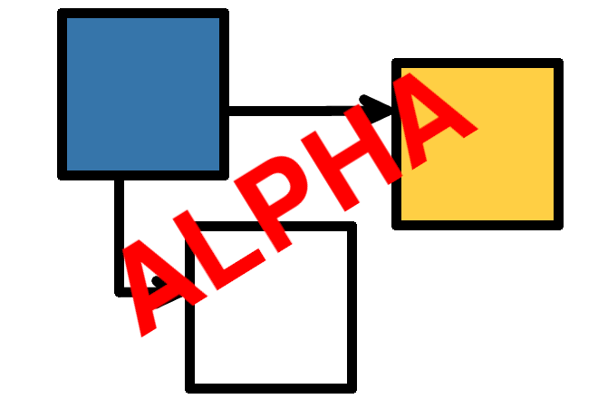

# PyperCard: simple Pythonic UIs



PyperCard is a [HyperCard](https://en.wikipedia.org/wiki/HyperCard) inspired
[Pythonic](https://www.python.org/dev/peps/pep-0020/)
[GUI](https://en.wikipedia.org/wiki/Graphical_user_interface) framework for
beginner programmers.

What does that mean?

PyperCard makes it quick and easy to use Python to create software with a
modern user interface to run on Windows, OSX, Linux, Android or iOS devices.

```{note}
**This documentation is for two sorts of readers**.

1. **Folks who want to use PyperCard to build cross platform GUI
applications**. If this is *you*, check out the [tutorials](tutorials.md)
first.  If you're already quite technical, you should see the
[cheatsheet](cheatsheet.md).

2. **Programmers who want to contribute to the development of PyperCard
itself**. If this is *you*, start with
[our guidance for contributing](contributing.md).

If you want further support, then please
[join the PyperCard channel on PyScript's discord server](https://discord.gg/TKyjvSynTP).
We're a friendly bunch and welcome questions from beginners.
```

PyperCard was created in response to the work of the wonderful folks at
Adafruit who designed a
[simple GUI library](https://learn.adafruit.com/circuit-python-your-own-adventure/overview)
for one of their CircuitPython based devices. PyperCard takes Adafruit's
original concept, refines it and makes it available on a large number of
computing platforms. To achieve this, PyperCard currently uses the
[PyScript](https://pyscript.net/) platform under the hood. PyScript makes it
easy to build Python applications in a browser (the world's most ubiquitous
computing platform).

While quite feature rich and powerful, PyperCard is
**deliberately constrained**. This makes it easy to learn ~ an
important consideration for beginner programmers.

Finally, if you find PyperCard frustrating because of the
constraints, then you're probably too advanced for PyperCard and should
graduate to a less constrained GUI framework such as native toolkits or
professional level web application frameworks.

## Contents

```{toctree}
:maxdepth: 2

tutorials.md
cheatsheet.md
contributing.md
design.md
code_of_conduct.md
API Reference <api/pypercard/pypercard.md>
License <license.md>
authors.md
```

