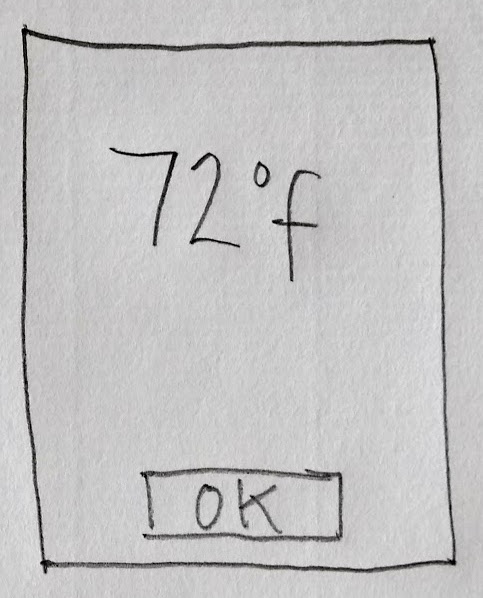
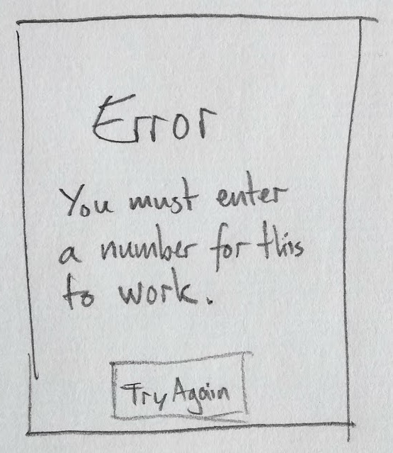

# Stacks of cards with transitions

To get the most from PyperCard you should understand three core concepts:

* stacks,
* cards, and,
* transitions.

To help, let's learn to think about how a PyperCard application works.

## Telling a story

When starting to design a project, one common approach is to create a visual
story-board that describes the user's journey through your application. It is
common for such story-boards to be drawn with a pencil and paper and they help
the developer think carefully about what the user may want or need and
visualise how this may look _before actually writing any code_ (thus saving
lots of time and effort).

The example shown below is for a
[very simple temperature conversion program](https://pyscript.github.io/pypercard/examples/temperature/).
Each rectangular box represents a card in the application, and drawn inside
each box is a rough outline of what the card should contain. The cards define
what the user can see. The cards are also roughly labelled so extra details are
revealed. The large thick arrows describe how the user moves between the
screens and will often have a description of what's going on drawn in or on
them.


Here's a fun question: how do you know folks will understand and like your
application before you've actually coded it?

One way is to draw each screen on a card and demonstrate a sort of "make
pretend" version of your application with potential users and your stack of
hand drawn cards.

## Test cards

For instance, I might say to a potential user, "here's the first screen in my
application and I want you to tell me what you're going to do...", and then
show them this card:


They might respond, "I'll type a number into the text box and then click on the
'Farenheit' button. I guess I'll be shown the old value converted from Celsius
into Farenheit." At which point I'll show them this second card:



"Let's just assume the number is the correct result. Now what do you do?", I
ask.

"I suppose I click on the 'OK' button, but I'm not sure what'll happen next",
they reply. At which point I show them the first card so they get to see that
users of the application are returned to the first screen.

Next I ask them what they think will happen if I don't type numbers into the
text box.

"I'm not sure. I suppose an error message of some sort, right..?", might be a
typical response. At which point I show them a third card:



I can use this as an opportunity to make sure the error message makes sense
and work out how they expect to correct such erroneous input.

"Perhaps the error message should just disappear after a few seconds if I don't
click 'Try again'...", they suggest.

That's it!

It's all rough and ready, but it's supposed to be. You're working things out,
playing around, thinking about what the user wants or needs, sketching the
process by which this is achieved and collaborating with potential users in a
"make pretend" way to figure out where you need to refine or change your ideas.
It's a really useful thing to do (and a lot of fun).

## Putting it all together

Once you're happy with your story-board and cards, PyperCard helps you to
convert your sketched out ideas into remarkably simple yet powerful computer-y
concepts which, as we shall see, can be used in very simple Python programs.

**Your application is like a stack of cards, with only the topmost card
visible.**

**Each card represents a screen in your application.**

**As the user does things, a transition causes a new card to be placed onto the
top of the stack (the equivalent of the arrows in the story-board).**

```{note}
We can't over state how important it is for you to understand and become
comfortable with these three simple concepts:

* The stack of cards _is your application_.
* A card is a screen in your application. Each card fulfils a specific role or
  function.
* A transition allows users to move between cards in a meaninful way, thus
  making the application useful.
```

Once you understand these three core concepts you'll start to see them in all
sorts of things and all over the place, which means you can use PyperCard to
make all sorts of interesting things.

This is what we'll explore in the next tutorial.
