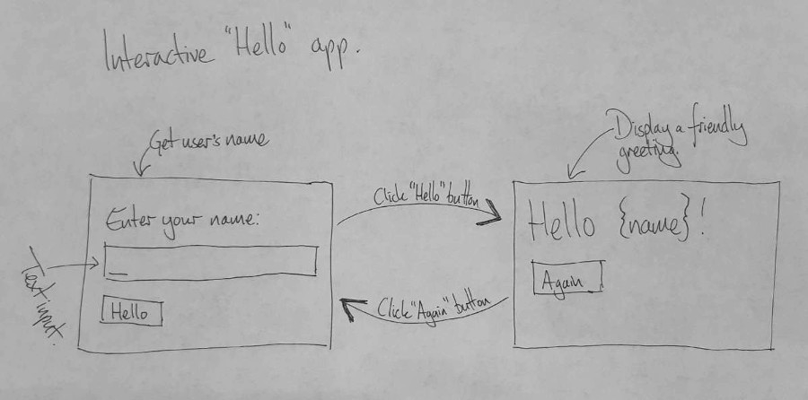

# Simple apps

Let's gently build a couple of first applications with PyperCard.

* An interactive "hello world", where the app asks for the user's name and then
  shows them a friendly greeting.
* The temperature app we sketched out in the previous tutorial.

The "hello world" app introduces how to define how cards look, how transitions
work, and how to get values from the user.

The temperature app demonstrates how to map the designs made on paper into
actual working code.

## Interactive hello

If the simplest application for PyperCard is one that simply says "hello", then
the simplest application with multiple cards and transitions is an interactive
"hello" application.

Put simply, the app asks for the user's name, then says "hello `{name}`"
(notice how I use `{name}` to represent a placeholder for the name they've
given.

This involves two cards and two transitions, as shown in this rough and ready
paper plan:




```html
<!DOCTYPE html>
<html lang="en">
<head>
    <title>Interactive Hello App</title>
    <meta charset="UTF-8">
    <meta name="viewport" content="width=device-width,initial-scale=1">
    <!-- This stylesheet makes the inputs and buttons look nice. -->
    <link rel="stylesheet" href="https://cdn.jsdelivr.net/npm/water.css@2/out/water.css">
    <!-- This tag loads PyScript -->
    <script defer src="https://pyscript.net/latest/pyscript.js"></script>
</head>
<body>
    <!-- This tells PyScript where to find the config file -->
    <py-config src="./pyscript.toml"></py-config>
    <!-- This tells PyScript where to find the Python code to run -->
    <py-script src="./main.py"></py-script>
    <!-- This is the template for the card with the id "get_name" -->
    <template id="get_name">
      <label for="name">Enter your name: </label>
      <input id="name" type="text" autofocus/>
      <button id="submit">Hello</button>
    </template>
    <!-- This is the template for the card with the id "say_hello" -->
    <template id="say_hello">
      <h1>Hello {name}!</h1>
      <button id="again" autofocus>Again</button>
    </template>
    <!-- That's it! -->
</body>
</html>
```

```toml
packages = ["pypercard" ]
```

```python
"""
A simple PyperCard app to get a user's name, and then display a friendly
"Hello world!" type message.
"""
# We need to use the a pypercard App.
from pypercard import App


# Create the app as the object called hello_app.
hello_app = App()


# In the "get_name" card, when you "click" on the "submit" button...
@hello_app.transition("get_name", "click", "submit")
def hello(app, card):
    """
    Store the value in the card's input box, with the id "name", into the app's
    datastore, under the key "name".

    Then transition to the "say_hello" card.
    """
    app.datastore["name"] = card.get_by_id("name").value
    return "say_hello"


# In the "say_hello" card, when you "click" on the "again" button...
@hello_app.transition("say_hello", "click", "again")
def again(app, card):
    """
    Don't do anything except transition to the "get_name" card.
    """
    return "get_name"


# Start the hello_app 
hello_app.start()
```

## Temps R'Us
