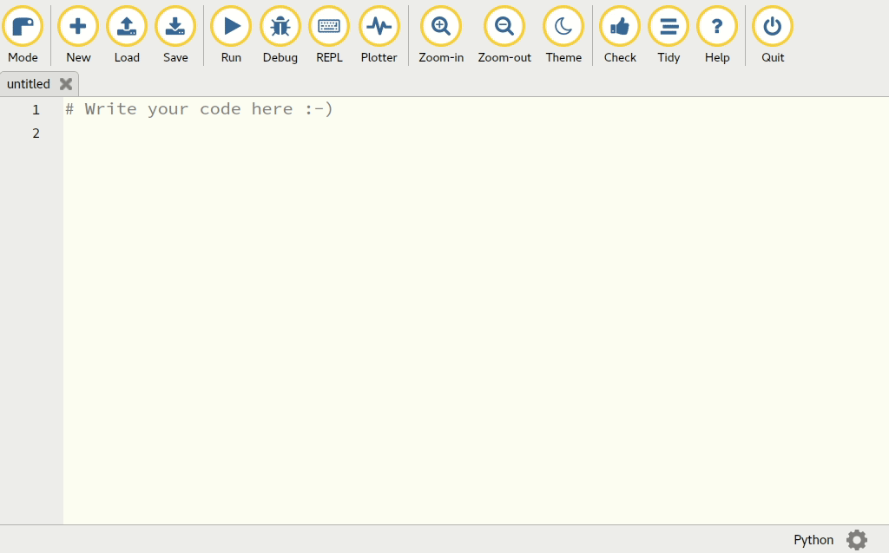

Install PyperCard
-----------------

With the Mu Editor
++++++++++++++++++

If you're using the latest (1.1) version of the
`beginner friendly Mu editor <https://codewith.mu/>`_, then installing
PyperCard is easy:

1. Click on the cog on the bottom right hand side of Mu's window.
2. Select the "Third Party Packages" tab in the resulting administration
   window.
3. Type ``pypercard`` into the text area, then click OK.
4. You should see a series of messages scroll by which tell you how the
   installation is progressing.
5. Mu should report that installation has finished without any errors.

(If you encounter errors when installing PyperCard, please tell us via
`the chat channel mentioned above <https://gitter.im/pypercard/community>`_).

This process is demonstrated in the following GIF animation:

With Standard Python
++++++++++++++++++++

If you're using just standard Python 3 with an editor other than Mu, install
PyperCard with the following command, ensuring you're in a virtualenv::

    pip install pypercard

It should look something like this:

.. image:: pip_pypercard.gif

If you're not using a virtualenv, you may need to use the following command
instead::

    pip3 install --user pypercard

(This will install PyperCard for use with your system's version of Python 3,
and put the package in a special directory in your home directory.)

Checking the Installation
+++++++++++++++++++++++++

Using Mu or any other editor with which you're familiar, type in the following
three lines of Python::

    from pypercard import Card, CardApp

    app = CardApp(stack=[Card("hello", text="Hello, World!")])
    app.run()

Save the file and call it something like ``pyperhello.py``.

If you're using Mu, ensure you're in Python3 mode (it should say "Python" at
the bottom right of Mu's window; if not, click the "Mode" button with the snake
on it and then select Python 3). Next, just click the "Run" button to see your
application run.

If you're using standard Python 3 with another editor, simply type the
following command while making sure your command line is running from the same
directory as where you saved the test script::

    python3 pyperhello.py

If all is well, you should see a window appear that looks something like this:

.. image:: pyperhello.png

To stop the application, just close the window!

Well done! You have successfully installed PyperCard. Let the fun begin (read
on).

.. warning::

    Your program may not work first time! Don't worry, this is quite normal.

    This is often because code was typed in incorrectly. Look out for
    erroneous capital letters (or lower case letters which should be
    capitalized), missing lines, wrong spellings and unnecessary punctuation.

    If you're using Mu, click on the "Check" button to show warnings about the
    code you've typed in (if it's correct, you won't see any!). You may also
    want to click on Mu's "Tidy" button to reformat your code to make it nice
    and neat.

Continue to :doc:`tutorial2`.
